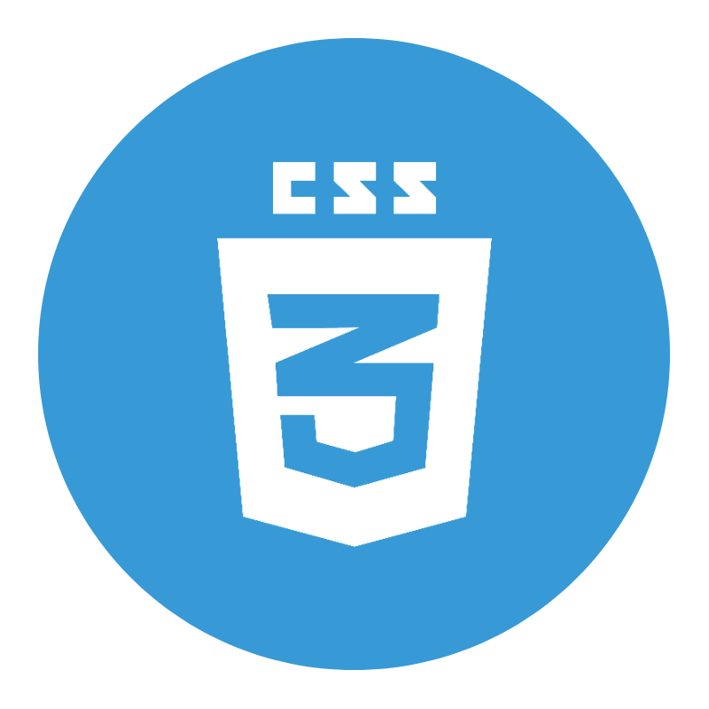

abul kasem / README.md  
 
  

# 👋 Hello, I'm Abul Kasem  

A full time content creator on & web developer  
🏠   Living: Tampere, Finland  

[][website]
[][youtube]
[][linkedin]
[][website]

### 🕵 &nbsp; About Me  

I am a passionate computer science teacher. I have been teaching programming languages, web development, and computer science-related subjects to millions of Bangla-speaking students worldwide through my YouTube channel for the last eight years. I had the opportunity to teach thousands of Bachelors's and Higher secondary students at different institutions in Bangladesh. After completing my master's in Software, Web and Cloud in August 2021, I am improving my web development skills. Every day I want to learn something new and share my knowledge with my students and others.
  

 

### 👨‍💻 &nbsp; My Skills & Videos:

#### Key Skills & Videos on Web development:

[][website]
[][website]
[][website]
[][website]
[][website]
[][website]

 

#### Other Skills & Videos:
[][website]
[][website]
[][website]
[][website]
[][website]

 

- [<u>Full-stack web development Bangla</u>][website]
- [<u>Artificial Intelligence (English)</u>](https://www.youtube.com/watch?v=ADFDxhipgiI&list=PLgH5QX0i9K3p06YY1fyReA2UK8mh_zsiY)
- [<u>Artificial Intelligence Bangla</u>](https://www.youtube.com/watch?v=ADFDxhipgiI&list=PLgH5QX0i9K3p06YY1fyReA2UK8mh_zsiY)
- [<u>Java Swing</u>](https://www.youtube.com/watch?v=ADFDxhipgiI&list=PLgH5QX0i9K3p06YY1fyReA2UK8mh_zsiY)
- [<u>Discrte Math</u>](https://www.youtube.com/watch?v=ADFDxhipgiI&list=PLgH5QX0i9K3p06YY1fyReA2UK8mh_zsiY)
- [<u>Theory of Computatino</u>](https://www.youtube.com/watch?v=ADFDxhipgiI&list=PLgH5QX0i9K3p06YY1fyReA2UK8mh_zsiY)
- [<u>Networking</u>](https://www.youtube.com/watch?v=ADFDxhipgiI&list=PLgH5QX0i9K3p06YY1fyReA2UK8mh_zsiY)

 

[][website]
[][linkedin]

 

### 💼 &nbsp; Employment History

| Position            | Institute                                   | Duration            | Location           |
| ------------------- | ------------------------------------------- | ------------------- | ------------------ |
| Full-stack trainer  | Integrify                                   | Aug 2022 - Running  | Helsinki, Finland  |
| Software Engineer   | M-Files                                     | Nov 2021 - Feb 2022 | Tampere, Finland   |
| Research Assistant  | Tampere University                          | Nov 2020 - Jan 2021 | Tampere, Finland   |
| Lecturer of ICT     | Jaflong Valley Boarding School              | Jul 2018 – Nov 2018 | Sylhet, Bangladesh |
| Guest Lecturer      | Sylhet Engineering College                  | Nov 2017 – Apr 2018 | Sylhet, Bangladesh |
| Android developer   | United Computer & Technical Training Center | Nov 2016 – Nov 2017 | Sylhet, Bangladesh |
| Lecturer of ICT     | Zhingabari High School & College            | May 2016 – Aug 2017 | Sylhet, Bangladesh |
| Content Creator     | YouTube                                     | Jan 2012- Running   | USA                |

 

### 🤵 Education  
1. M.Sc. in Software, Web & Cloud  
Tampere University  
Tampere, Finland
2. B.Sc. in Computer Science & Engineering  
Leading University  
Sylhet, Bangladesh.  
3. Professional Diploma in Travel & Tourism  
London School of Commerce & IT  
London, England.  

 
 

---

Thanks for going through my Portfolio. All rights reserved by Anisul Islam @2021

---

[website]: https://www.github.com
[youtube]: https://www.youtube.com
[facebook]: https://www.facebook.com
[linkedin]: https://www.linkedin.com

